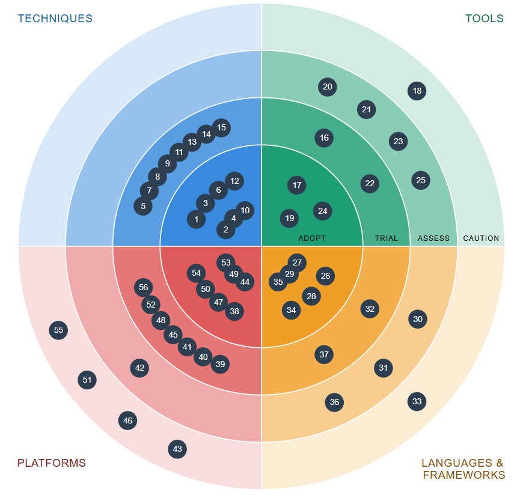

# Tech Radar
A visualization of technologies I used in past projects and to what degree I've adopted them.

## Reading the Radar
Like the original [Tech Radar from Thoughtworks](https://www.thoughtworks.com/radar) the radar is divided into four quadrants and four rings. Although the labels are the same I define the meaning of the rings slightly different from the original:

### Rings
**Adopt:** My go-to stack when given the choice and reasonable to do so.

**Trial:** Technologies that may be well established but I just haven't fully grasped yet.

**Assess:** Technologies I recently started using in a personal or professional context.

**Caution:** Things I used once but wouldn't use again if given the choice.

### Quadrants
**Techniques:** Practices, patterns and approaches for building, designing and delivering software.

**Tools:** Software that supports my development workflow.

**Languages & Frameworks:** The languages, runtimes and libraries my code is based on.

**Platforms:** Managed services, infrastructure or cloud offerings I deploy to or depend on at runtime.
